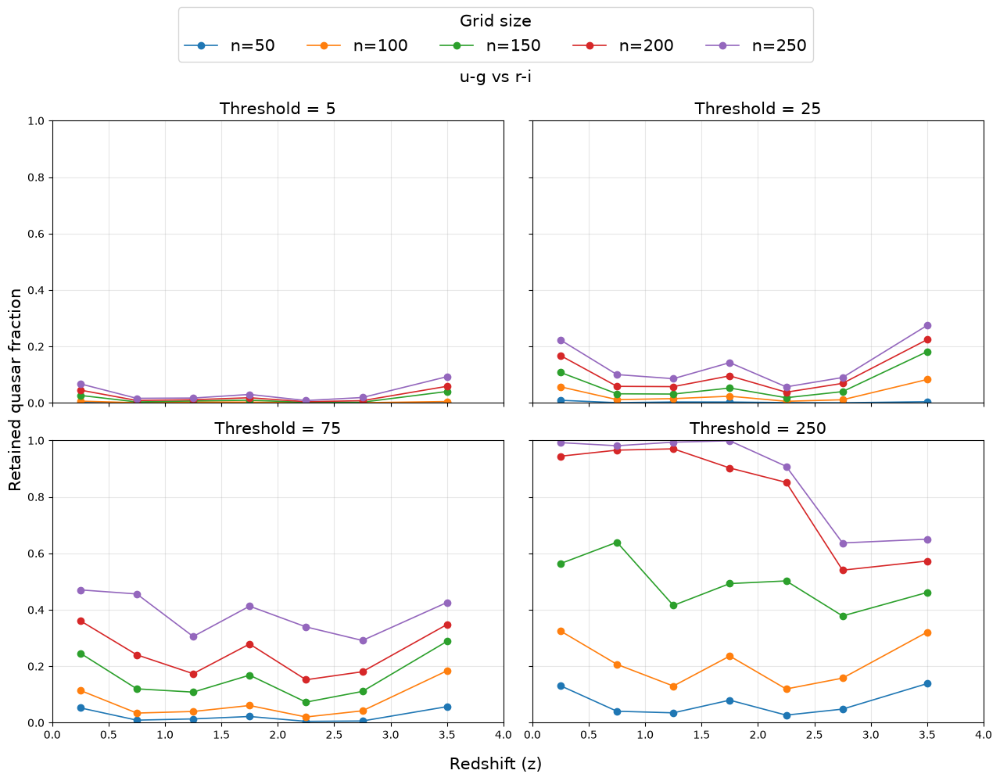

# Redshift Evolution of SDSS Quasar Colors and Their Photometric Overlap with the Stellar Locus

Analysis of ~163,000 SDSS DR16Q quasars and ~1.9 million SDSS stars, quantifying how quasar–star color overlap changes with redshift. Using a grid-based retention metric with binomial and bootstrap uncertainty estimates, the analysis recovers the known z ≈ 2.7 quasar–star color degeneracy and shows it is most pronounced in color combinations involving u−g.



## Key Result

At the primary grid resolution, the retained quasar fraction in (u−g) vs. (r−i) falls to ~0.54 at 2.5 < z ≤ 3.0, consistent with the well-known similarity between quasar colors and early F/late A stars near this redshift.

## Repository Structure

```text
├── Data/               Raw FITS files (not tracked — see Data/README.md)
├── Figures/            Generated figures
├── Notebooks/          Analysis pipeline (run in numbered order)
├── README_assets/      README images
├── Outputs/            CSV/NPZ intermediate and final results
└── SQL/                CasJobs queries for the stellar catalog
```

## Setup

Install the required Python packages with:

    pip install -r requirements.txt

## Data

Raw FITS files are not tracked in this repository. Download:

- DR16Q v4: [SDSS DR16Q v4](https://www.sdss4.org/dr17/algorithms/qso_catalog/)
- Stellar catalog: run `SQL/star_catalog_query.sql` via SDSS CasJobs.

Place both files in `Data/` before running the notebooks.

## Running the Pipeline

Run the notebooks in order:

1. `01_Data_Selection.ipynb` - sample selection and quality cuts
2. `02_Color_Evolution.ipynb` - color–redshift statistics
3. `03_Stellar_Locus_and_Retention.ipynb` - grid construction and retention fraction
4. `04_Selection_Efficiency_and_Robustness_Test.ipynb` - sensitivity and bootstrap testing

## Authors

Le Hai Dang  
Hua Thanh Duy

## Contact

For questions regarding the analysis or repository, contact danglepvt@gmail.com.

## Acknowledgements

We thank the Haus der Astronomie and the Max Planck Institute for Astronomy for the opportunity to undertake this research through the International Summer Internship. We also thank Niall Deacon for his guidance, feedback, and valuable discussions.

This project makes use of data from the Sloan Digital Sky Survey (SDSS) and the following Python packages: Astropy, NumPy, pandas, and Matplotlib.

## Citation

If you use this code, please cite the [Zenodo record](https://doi.org/10.5281/zenodo.22283115).

## License

Code: MIT.
